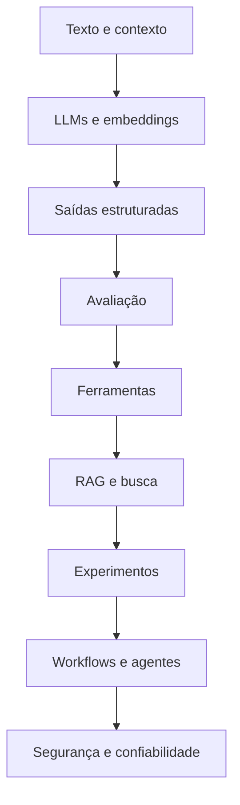

# Mapa conceitual

```mermaid
flowchart TD
  A[Texto e contexto] --> B[LLMs e embeddings]
  B --> C[Saídas estruturadas]
  C --> D[Avaliação]
  D --> E[Ferramentas]
  E --> F[RAG e busca]
  F --> G[Experimentos]
  G --> H[Workflows e agentes]
  H --> I[Segurança e confiabilidade]
```

A sequência não representa apenas aumento de complexidade técnica. Cada etapa introduz uma nova pergunta sobre a qualidade e os limites do sistema.
